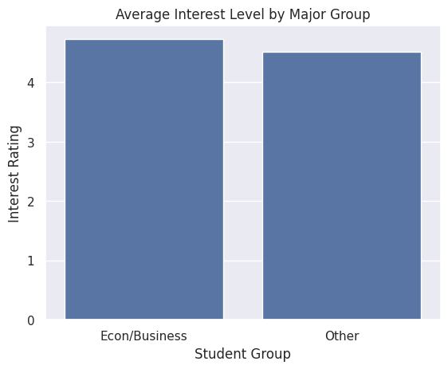
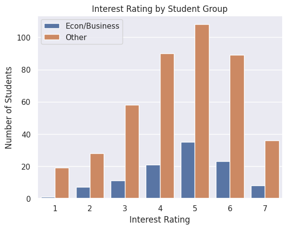
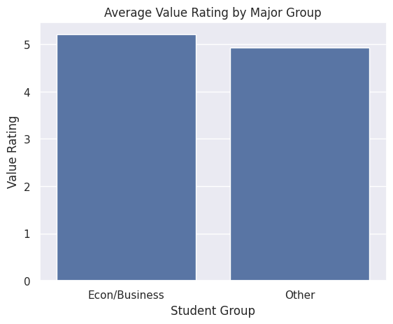

---
# Do not edit the text between these lines!
layout: default
---

# Data Visualizations

<!-- This is a comment. Below, you'll see code for inserting an image. To make this image appear, update <custom-path>. To add an image, save it inside the imgs folder of this repository. -->

## Conclusion

This is basic paragraph text.
After our data alalysis we found that roughly 19.85% of students in comp110 are economics or business Majors. When asked to rank how valuable they thought the course content was on a scale from 1 to 7, with 1 being least valuable and 7 being the most, economics and business majors ranked an average of 5.2. When asked a similar questino about how important they though the course content was ranked on the same scale, econ and business majors ranked an average of 4.7. Meanwhile students from all other majors ranked value an average of a 4.9 on a 1 to 7 scale, and ranked how interesting the course content was an average of 4.2 on a 1 to 7 scale. This data refutes slightly our idea that Comp110 should include more Economics or Business related examples in class to support engagement and interest, as econ or business majors through their rankings already view Comp110 as more interesting and valuable on agerage when compared to other majors. However, we recognize a few major problems with this reasoning. For example, since non-econ or business majors make up over 80% of the class, there could be certain majors that are ranking value and interest disproportionatly low when compared to others, and through initial our analysis we would have no way of recognising that. In the future, we could gather more data surrounding how economics or business students view or use the course content by asking specific survey questions like "how often do you see yourself utilizing the skills learned in this class in your personal or professional life?" Questaions like this serve a more specific purpose in guaging how applicable all students feel the course content is to them, and when narrowed down to economics and business students will give a more specific understanding to these "interesting" and "valuablw" traits. While there would be some benefits to adding more econ or business related questions in class, this might negativly impact the experience of other students in the class who may not find those questions as interesting or valuable. Seeing as non-economics and business students rank these attributes lower than economics and business students, adding more economics or business-related questions might have an even greater negative impact. Furthermore, it would create a need for new question writing and course-design adjustments which are time consuming for TA's and Professors alike. All in all, our analysis refutes our idea that Comp110 should implement more business or economics oriented examples in class.